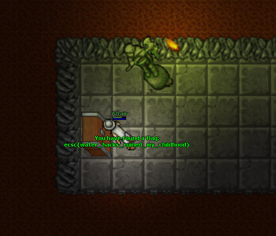

# Easy Tibia
## Pts: 200
```
We are running a MMORPG game server, but turns out there are lots of troubles with it. Yesterday we've added a new island on the map (in the left-bottom corner). It is not reachable in any normal way, because yet there is no bridge which would allow to get there. However, we've found that some players succesfully used hacks in order to do so. Could you investigate?

The server is located there: https://game-server.ecsc18.hack.cert.pl.

Hint: In order to run game client, you either have to compile it from sources or use Vagrant. Build instructions are in README.md file of the otclient.tgz package. If you have any trouble building the client, use vagrant up --provider=virtualbox command and the required environment should be set up automatically. If using vagrant, login/password are vagrant/vagrant and everything is in the /vagrant directory.

Format flagi: ecsc{litery_cyfry_i_znaki_specjalne}.
```

After creating the account and building the client I found the island and started investigating.
It turns out, if you try and "use" a tile on the island, you can walk on water!


Opening the chest in the dungeon gives you the flag.


