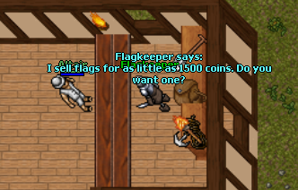
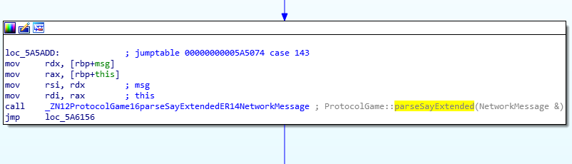
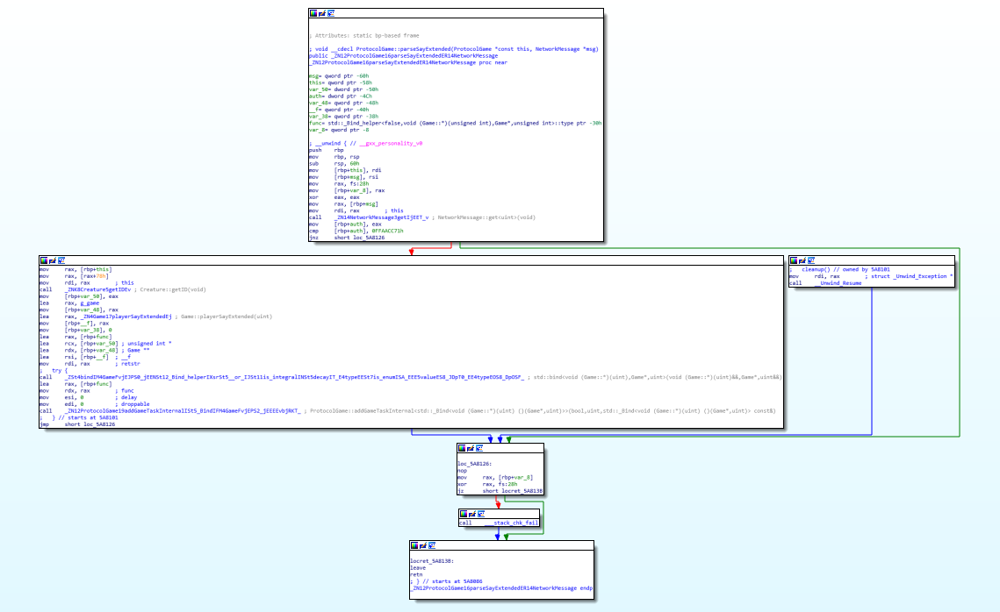
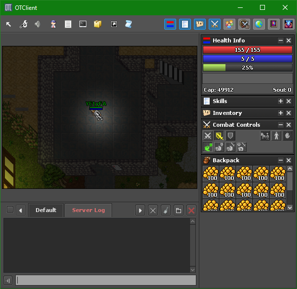

# Hard Tibia (re/misc) 400pts

```
We are running a MMORPG game server, but turns out there are lots of troubles with it. Yesterday the server was hacked and its executable was replaced with another one.
tfs_original
tfs_backdoored
The server is still running the backdoored version and is located there: https://game-server.ecsc18.hack.cert.pl

Hint: Questions related to game play may be asked on IRC channel (#ecsc18 on FreeNode). Spoiling the task is still prohibited.

Hint: In order to play, download game client source package and compile it using cmake (see README.md for instructions).

Format flagi: ecsc{litery_cyfry_i_znaki_specjalne}.
```

I accessed the server and met the Flagkeeper.



Unfortunately we start only with three pieces of cheese. Only way to get gold is to hunt goblins in the northern part of the map, but they only drop about 3gp each. We need a way to get rich fast.

As in the description, we are provided with two files, one with the backdoor. I decided to try and diff them, but ordinary binary diffing will not work here, because the binary has been recompiled. I used `radiff2`, which is a bit more clever, as it can recognize modified functions and sort them by how much they differ.

`radiff2 -CA tfs_original tfs_backdoored` yielded (after a loooong time):

```
sym.__libc_csu_init   101 0x6367d0 |   MATCH  (0.940594) | 0x636d20    101 sym.__libc_csu_init
sym.__libc_csu_fini     2 0x636840 |   MATCH  (1.000000) | 0x636d90      2 sym.__libc_csu_fini
sym._fini     9 0x636844 |   MATCH  (1.000000) | 0x636d94      9 sym._fini
fcn.0036b5d8    15 0x36b5d8 |     NEW  (0.000000)
fcn.003b5bfc    44 0x3b5bfc |     NEW  (0.000000)
fcn.003b6658     9 0x3b6658 |     NEW  (0.000000)
fcn.003b7532     9 0x3b7532 |     NEW  (0.000000)
sym.Game::playerSayExtended  1013 0x3ffd8a |     NEW  (0.000000)
fcn.00437e12    11 0x437e12 |     NEW  (0.000000)
fcn.00465072    62 0x465072 |     NEW  (0.000000)
fcn.004660dc    43 0x4660dc |     NEW  (0.000000)
sym.ProtocolGame::parseSayExtended   175 0x5a8086 |     NEW  (0.000000)
fcn.005e3581    31 0x5e3581 |     NEW  (0.000000)
```

We have some interesting new functions, `ProtocolGame::parseSayExtended` and `Game::playerSayExtended`. Also, we have symbols so let's grab [the "forgotten server" code](https://github.com/otland/forgottenserver).

Let's load the file in IDA and see how we can access any of the new functions (which obviously smell like a backdoor to me).

It turns out that the `Game::playerSayExtended` is referenced only from `ProtocolGame::parseSayExtended`, which in turn is referenced only from `ProtocolGame::parsePacket`, which certainly sounds like an entry point for our exploits.



Let's open the original code for this function and try and see where the call is injected:
```cpp
void ProtocolGame::parsePacket(NetworkMessage& msg)
{
	if (!acceptPackets || g_game.getGameState() == GAME_STATE_SHUTDOWN || msg.getLength() <= 0) {
		return;
	}

	uint8_t recvbyte = msg.getByte();

  // ...

	switch (recvbyte) {
		//...
		case 0x8D: parseLookInBattleList(msg); break;
		case 0x8E: /* join aggression */ break;
		//   0x8F: parseSayExtended(msg); break;
		case 0x96: parseSay(msg); break;
    // ...
	}

  // ...
}
```

The attackers chose an unused packet type to implement the backdoor. Quick look at the `parseSayExtended` suggests some kind of auth check:



```asm
mov     rax, [rbp+msg]
mov     rdi, rax        ; this
call    NetworkMessage::get<uint>(void)
mov     [rbp+auth], eax
cmp     [rbp+auth], 0FFAACC71h
jnz     short loc_5A8126
mov     rax, [rbp+this]
mov     rax, [rax+78h]
mov     rdi, rax        ; this
call    Creature::getID(void)
mov     [rbp+var_50], eax
lea     rax, g_game
mov     [rbp+var_48], rax
lea     rax, Game::playerSayExtended(uint)
mov     [rbp+__f], rax
mov     [rbp+var_38], 0
lea     rax, [rbp+func]
lea     rcx, [rbp+var_50] ; unsigned int *
lea     rdx, [rbp+var_48] ; Game **
lea     rsi, [rbp+__f]  ; __f
mov     rdi, rax        ; retstr
call    std::bind<void (Game::*)(uint),Game*,uint>(void (Game::*)(uint)&&,Game*,uint&&)
lea     rax, [rbp+func]
mov     rdx, rax        ; func
mov     esi, 0          ; delay
mov     edi, 0          ; droppable
call    ProtocolGame::addGameTaskInternal<std::_Bind<void (Game::*)(uint) ()(Game*,uint)>>(bool,uint,std::_Bind<void (Game::*)(uint) ()(Game*,uint)> const&)
```

I cleaned up the code of some mangled symbols, but we can clearly see that the server checks if the packet contains `0xFFAACC71`, and only then it executes `Game::playerSayExtended(Player->getID())`. That's a nice start, let's try and send this packet to the backdoored server. I did it in the simplest way possible, by modifying the client code so that every time I send a message, it also triggers the backdoor.
Let's take a look at some code similar in function so that we can modify it...

```cpp
// client/protocolgamesend.cpp
void ProtocolGame::sendTalk(Otc::MessageMode mode, int channelId, const std::string& receiver, const std::string& message)
{
    this->TriggerBackdoor();

    if(message.empty())
        return;

    if(message.length() > 255) {
        g_logger.traceError("message too large");
        return;
    }

    OutputMessagePtr msg(new OutputMessage);
    msg->addU8(Proto::ClientTalk);
    msg->addU8(Proto::translateMessageModeToServer(mode));

    switch(mode) {
    case Otc::MessagePrivateTo:
    case Otc::MessageGamemasterPrivateTo:
    case Otc::MessageRVRAnswer:
        msg->addString(receiver);
        break;
    case Otc::MessageChannel:
    case Otc::MessageChannelHighlight:
    case Otc::MessageChannelManagement:
    case Otc::MessageGamemasterChannel:
        msg->addU16(channelId);
        break;
    default:
        break;
    }

    msg->addString(message);
    send(msg);
}
```

Turns out the Tibia protocol is really simple, we manually construct the packet from bytes - that's perfect for our needs. Let's now write our `TriggerBackdoor` function:
```cpp
// client/protocolgamesend.cpp
void ProtocolGame::TriggerBackdoor()
{
    OutputMessagePtr msg(new OutputMessage);
    msg->addU8(Proto::ClientBackdoor); // this is just a constant = 143
    msg->addU32(0xFFAACC71);
    send(msg);    
}
```

If you build the client and join the server, nothing extraordinary happens until you send a message. This causes your hp to drop by 10. We're getting closer, but not quite there.

`Game::playerSayExtended(uint32_t playerId)` contains extra checks which prevent us from profiting from the backdoor. Quick decompilation yields folowing (more-or-less readable) code:

```cpp
void __cdecl Game::playerSayExtended(Game *const this, uint32_t playerId)
{
  const Position *pos; // ST30_8
  unsigned __int8 c1; // ST1A_1
  bool v4; // al
  const Container *v5; // rax
  const ItemDeque *__for_range; // ST50_8
  std::_Deque_iterator<Item*,Item* const&,Item* const*>::reference v7; // rax
  bool v8; // al
  const Position *v9; // rcx
  unsigned int i; // [rsp+1Ch] [rbp-A4h]
  uint64_t coeff2; // [rsp+20h] [rbp-A0h]
  Player *player; // [rsp+28h] [rbp-98h]
  const std::__cxx11::string *pn; // [rsp+38h] [rbp-88h]
  uint64_t coeff1; // [rsp+40h] [rbp-80h]
  Item *backpack; // [rsp+48h] [rbp-78h]
  Item *item; // [rsp+58h] [rbp-68h]
  std::deque<Item*,std::allocator<Item*> >::const_iterator __for_begin; // [rsp+60h] [rbp-60h]
  std::deque<Item*,std::allocator<Item*> >::const_iterator __for_end; // [rsp+80h] [rbp-40h]
  unsigned __int64 v19; // [rsp+A8h] [rbp-18h]

  v19 = __readfsqword(0x28u);
  player = Game::getPlayerByID(this, playerId);
  if ( player )
  {
    Player::resetIdleTime(player);
    pos = (const Position *)(*(__int64 (__fastcall **)(Player *))(*(_QWORD *)player->gap0 + 64LL))(player);
    pn = (const std::__cxx11::string *)(*(__int64 (__fastcall **)(Player *))(*(_QWORD *)player->gap0 + 192LL))(player);
    coeff1 = 1693 * (pos->y + pos->x + (unsigned int)pos->z) % 811;
    coeff2 = 0LL;
    for ( i = 1;
          i < (unsigned __int64)std::__cxx11::basic_string<char,std::char_traits<char>,std::allocator<char>>::length(pn);
          i += 2 )
    {
      c1 = *(_BYTE *)std::__cxx11::basic_string<char,std::char_traits<char>,std::allocator<char>>::operator[](pn, i - 1);
      coeff2 += c1 ^ (unsigned __int8)~*(_BYTE *)std::__cxx11::basic_string<char,std::char_traits<char>,std::allocator<char>>::operator[](
                                                   pn,
                                                   i);
    }
    if ( coeff1 == 4273 * coeff2
                 - 821 * ((unsigned __int64)(0x9FA6328395FBA275LL * (unsigned __int128)(4273 * coeff2) >> 64) >> 9) )
    {
      backpack = player->inventory[3];
      v4 = backpack && (*(unsigned __int8 (__fastcall **)(Item *))(*(_QWORD *)backpack->gap0 + 136LL))(backpack) ^ 1;
      if ( v4 && (*(__int64 (__fastcall **)(Item *))(*(_QWORD *)backpack->gap0 + 88LL))(backpack) != 0 )
      {
        v5 = (const Container *)(*(__int64 (__fastcall **)(Item *))(*(_QWORD *)backpack->gap0 + 88LL))(backpack);
        __for_range = Container::getItemList(v5);
        std::deque<Item *,std::allocator<Item *>>::begin(&__for_begin, __for_range);
        std::deque<Item *,std::allocator<Item *>>::end(&__for_end, __for_range);
        while ( std::operator!=<Item *,Item * const&,Item * const*>(&__for_begin, &__for_end) )
        {
          v7 = std::_Deque_iterator<Item *,Item * const&,Item * const*>::operator*(&__for_begin);
          item = *v7;
          v8 = (*(unsigned __int8 (__fastcall **)(Item *const , std::deque<Item*,std::allocator<Item*> >::const_iterator *))(**(_QWORD **)v7 + 136LL))(
                 *v7,
                 &__for_end) ^ 1
            && Item::isStackable(item);
          if ( v8 )
            Item::setItemCount(item, 100u);
          std::_Deque_iterator<Item *,Item * const&,Item * const*>::operator++(&__for_begin);
        }
        Player::kickPlayer(player, 1);
        v9 = (const Position *)(*(__int64 (__fastcall **)(Player *, signed __int64))(*(_QWORD *)player->gap0 + 64LL))(
                                 player,
                                 1LL);
        Game::addMagicEffect(this, v9, 3u);
      }
    }
    else
    {
      (*(void (__fastcall **)(Player *, _QWORD, signed __int64))(*(_QWORD *)player->gap0 + 544LL))(player, 0LL, 10LL);// hurt player?
      Game::addCreatureHealth(this, &player->0);
    }
  }
}
```

Unfortunately we do not have all offsets resolved, and I couldn't fix them manually. I tried running the server locally and debugging it to try and guess the method calls, but failed miserably because of library dependencies. We have some type information, which will help us. We can see that the code computes two values, one from some `Position` value, and the second from `std::string` obtained from `Player` object, and then compares them. Looking at the code my first guess is that the position is either the player current position, login position, or temple position. The string is most likely the character's nick. 

As for the code effects, either it does something with our inventory, setting some `itemCount`s to 100 and kicking us off the server, or (if we fail the check) does something with our health, which we could see previously. 

I modified the client to print current player position every time I move, and discovered the spawn position to be `(95, 117, 7)`. You can quite easily bruteforce the nick required to pass the check (see `brute.cpp`). After creating new account with the calculated nickname, I tested the exploit. My client was immediately disconnected, and the 3gp I had in the backpack turned into 100gp stack. Rinse and repeat.



Only thing left is to buy the flag!


