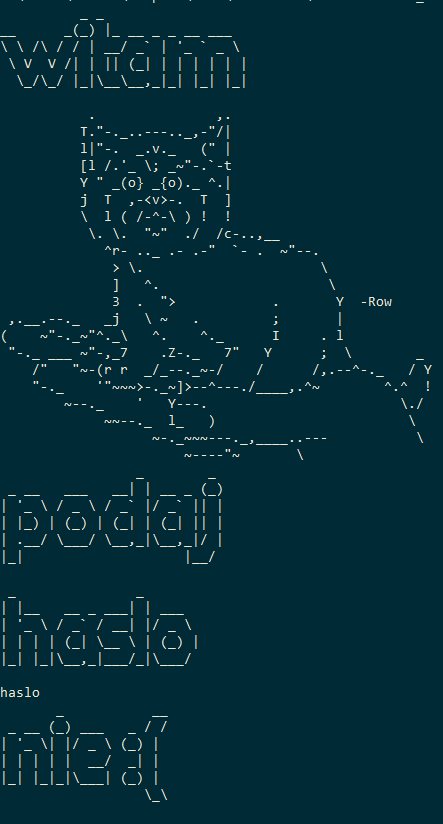
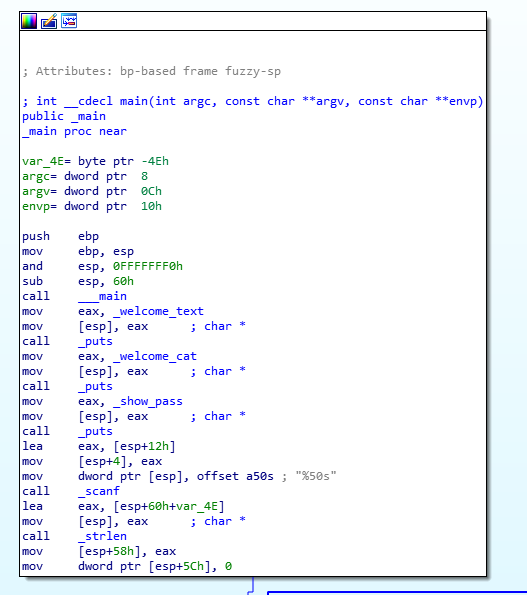
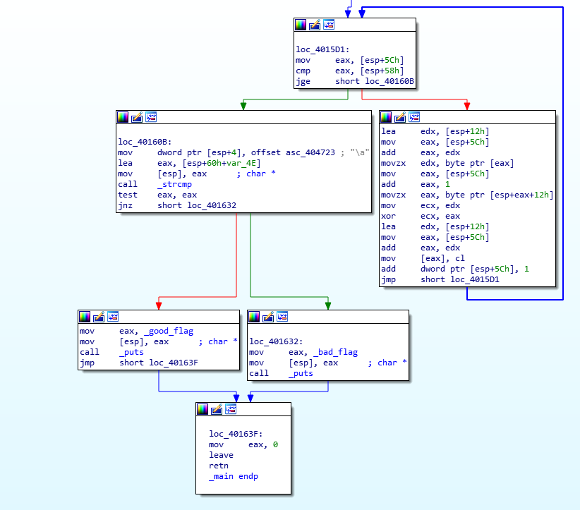
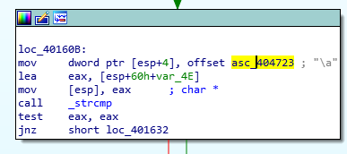

# Reverse it (re)
## Pts: 50

```
Lokalny fanatyk kotów zabezpieczył swoją bazę kotów za pomocą hasła.
Jedyny sposób żeby poznać hasło uzyskać dostęp do gigabajtów kotów to złamanie jego programu.

Czy podołasz wyzwaniu?

Format flagi: pwn{litery_cyfry_i_znaki_specjalne}.
```

Po uruchomieniu `it(...).exe` widzimy obrazek z kotem i pytanie o hasło:



Naturalnie pierwsze co robimy to wrzucamy plik do IDA:






Schemat jest bardzo prosty, po chwili analizy widzimy że jedyne co program robi to wczytuje od nas ciąg znaków, operuje na nim w pętli a następnie porównuje z jakimś statycznym ciągiem.

Po szybkiej ręcznej dezasemblacji (najważniejszy fragment):
```c
scanf("%50s", in_string);
slen = strlen(in_string);

int i = 0;

while(i < slen)
{
	in_string[i] = (byte)(in_string[i] ^ in_string[i+1]);
	i++;
}

if (strcmp(in_string, asc_404723) == 0)
	good_flag();
else
	bad_flag();
```

Trudno nazwać ten algorytm szyfrowaniem, jako że nie wymaga on żadnego sekretu. Każda litera xor-owana jest z jej następnikiem, można to sobie wyobrazić jako xor po literach na dwóch ciągach - oryginalnym i przesuniętym o jeden w prawo. Obserwacja jest dość prosta - ostatnia litera jest nienaruszona. Staje się ona "wytrychem", który pozwala na odszyfrowanie poprzedniej litery, a dzięki niej kolejnej i tak dalej, aż do odszyfrowania całości. Zerknijmy na zakodowaną wersję hasła:

```assembly
.rdata:00404723 asc_404723      db 7                    ; DATA XREF: _main:loc_40160B↑o
.rdata:00404724                 db  19h
.rdata:00404725                 db  15h
.rdata:00404726                 db  18h
.rdata:00404727                 db  11h
.rdata:00404728                 db  0Bh
.rdata:00404729                 db    9
.rdata:0040472A                 db    4
.rdata:0040472B                 db  1Bh
.rdata:0040472C                 db  30h ; 0
.rdata:0040472D                 db  1Eh
.rdata:0040472E                 db  0Fh
.rdata:0040472F                 db  0Ah
.rdata:00404730                 db  1Bh
.rdata:00404731                 db  2Dh ; -
.rdata:00404732                 db  17h
.rdata:00404733                 db  13h
.rdata:00404734                 db  13h
.rdata:00404735                 db  17h
.rdata:00404736                 db    1
.rdata:00404737                 db  16h
.rdata:00404738                 db  18h
.rdata:00404739                 db  7Dh ; }
.rdata:0040473A                 db    0
.rdata:0040473B                 db    0
```

IDA podpowiada że ostatni znak to '}' - czyli obserwacja się potwierdza. Ostatni krok to napisanie skryptu który odwróci kodowanie.

```python
enc = [0x7, 0x19,0x15,0x18,0x11,0x0B,0x9,0x4,0x1B,0x30,0x1E,0x0F,0x0A,0x1B,0x2D,0x17,0x13,0x13,0x17,0x1,0x16,0x18,0x7D,0x0,0x0][::-1]

res = [0]*len(enc)

for i in range(1, len(enc)):
	res[i] = res[i-1] ^ enc[i]


print("".join([chr(i) for i in res[::-1]]))
	
```

Zadanie rozwiązane!
Flaga: `pwn{crypto_AND_reverse}`.