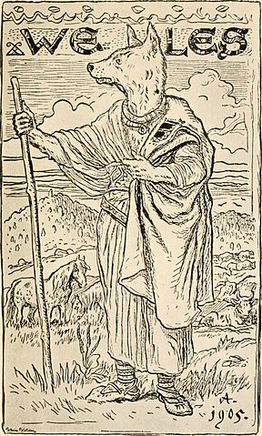

# Easy Volos (stego)
## Pts: 100

```
Great Volos - god of magic is around you. Just look carefully.

Format flagi: ecsc{litery_cyfry_i_znaki_specjalne}.
```


Dostajemy tylko plik `volos.png` (widoczny powyżej). Odpalamy binwalka z opcją `-e` (czyli `extract`):
```
$ binwalk -e volos.png

DECIMAL       HEXADECIMAL     DESCRIPTION
--------------------------------------------------------------------------------
0             0x0             PNG image, 288 x 479, 8-bit/color RGBA, non-interlaced
41            0x29            Zlib compressed data, best compression
381077        0x5D095         Zlib compressed data, default compression
```

Pod offsetem `0x5d095` znajduje się skompresowany plik, który binwalk rozpakował do `volos.png.extracted/5D095`:

```
####################################################
####################################################
####################################################
####################################################
####################################################
########     ecsc{inflat3_or_d3flate}      #########
####################################################
####################################################
####################################################
####################################################
####################################################
```

I cyk zadanie rozwiązane.