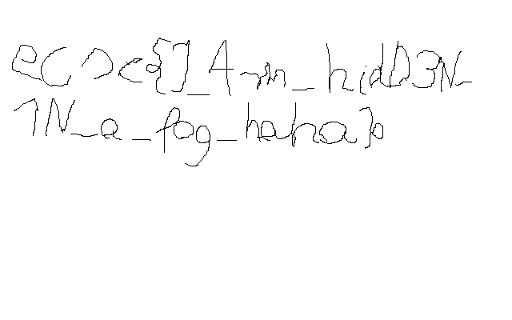

# Ignite the seeds (stego)
## Pts: 50

```
During our trip to Sniardwy lake we got lost and our GPS is broken. We have a map but our brains cannot parse it. Help us to find the way!

task.bmp

Format flagi: ecsc{litery_cyfry_i_znaki_specjalne}.
```

Dostajemy plik o rozszerzeniu `.bmp` ale nie da się go normalnie otworzyć. Możemy zajrzeć do środka hex edytorem (lub zwykłym `xxd`), być może rozpoznamy z czym mamy do czynienia.

```
$ xxd -i task.bmp | head -n 20
00000000: ffff ffff ffff ffff ffff ffff ffff ffff  ................
00000010: ffff ffff ffff ffff ffff ffff ffff ffff  ................
00000020: ffff ffff ffff ffff ffff ffff ffff ffff  ................
00000030: ffff ffff ffff ffff ffff ffff ffff ffff  ................
00000040: ffff ffff ffff ffff ffff ffff ffff ffff  ................
00000050: ffff ffff ffff ffff ffff ffff ffff ffff  ................
00000060: ffff ffff ffff ffff ffff ffff ffff ffff  ................
00000070: ffff ffff ffff ffff ffff ffff ffff ffff  ................
00000080: ffff ffff ffff ffff ffff ffff ffff ffff  ................
00000090: ffff ffff ffff ffff ffff ffff ffff ffff  ................
000000a0: ffff ffff ffff ffff ffff ffff ffff ffff  ................
000000b0: ffff ffff ffff ffff ffff ffff ffff ffff  ................
000000c0: ffff ffff ffff ffff ffff ffff ffff ffff  ................
000000d0: ffff ffff ffff ffff ffff ffff ffff ffff  ................
000000e0: ffff ffff ffff ffff ffff ffff ffff ffff  ................
000000f0: ffff ffff ffff ffff ffff ffff ffff ffff  ................
00000100: ffff ffff ffff ffff ffff ffff ffff ffff  ................
00000110: ffff ffff ffff ffff ffff ffff ffff ffff  ................
00000120: ffff ffff ffff ffff ffff ffff ffff ffff  ................
00000130: ffff ffff ffff ffff ffff ffff ffff ffff  ................
```

Niezbyt ciekawe, zobaczmy z drugiej strony:

```
$ xxd task.bmp | tail -n 5
000bb830: 0000 0000 0000 0000 0000 0000 0000 0000  ................
000bb840: 7352 4742 0000 0000 0000 0000 0000 0b13  sRGB............
000bb850: 0000 0b13 000b b800 0000 0000 0018 0001  ................
000bb860: 0000 0190 0000 0280 0000 006c 0000 007a  ...........l...z
000bb870: 0000 0000 000b b87a 4d42                 .......zMB
```

`MB` to `BM` od tyłu, co jest magiczną liczbą właśnie dla formatu BMP. Odwróćmy zatem cały plik.

```
$ < task.bmp xxd -p -c1 | tac | xxd -p -r > out.bmp

$ file out.bmp
out.bmp: PC bitmap, Windows 95/NT4 and newer format, 640 x 400 x 2
```



Reszta jest raczej oczywista.