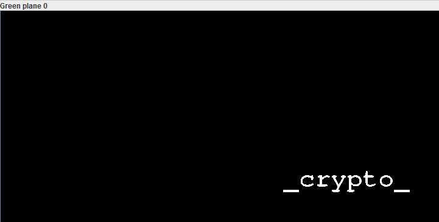
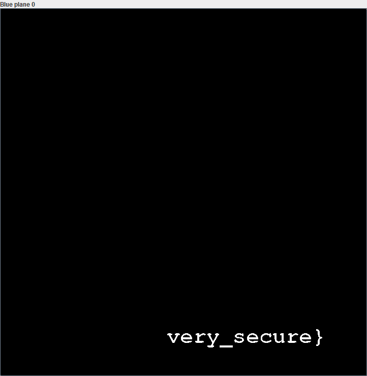

# Learn Some Basics (stego)
## Pts: 50

```
Help the doggo Learn Some Basics of steganography.
Format flagi: ecsc{litery_cyfry_i_znaki_specjalne}.
```

Jedyny materiał to zdjęcie pieseła. Początkowy rekonesans nie pokazuje żadynch anomalii.

```
$ file help_the_doggo.png
help_the_doggo.png: PNG image data, 720 x 720, 8-bit/color RGBA, non-interlaced

$ binwalk help_the_doggo.png

DECIMAL       HEXADECIMAL     DESCRIPTION
--------------------------------------------------------------------------------
0             0x0             PNG image, 720 x 720, 8-bit/color RGBA, non-interlaced
123           0x7B            Zlib compressed data, best compression

$ pnginfo help_the_doggo.png
help_the_doggo.png...
  Image Width: 720 Image Length: 720
  Bitdepth (Bits/Sample): 8
  Channels (Samples/Pixel): 4
  Pixel depth (Pixel Depth): 32
  Colour Type (Photometric Interpretation): RGB with alpha channel
  Image filter: Single row per byte filter
  Interlacing: No interlacing
  Compression Scheme: Deflate method 8, 32k window
  Resolution: 2835, 2835 (pixels per meter)
  FillOrder: msb-to-lsb
  Byte Order: Network (Big Endian)
  Number of text strings: 1 of 9
    Comment (unknown compression): bork
```

W takim razie wrzucamy obrazek w znane i lubiane narzędzie StegSolve. Prawie natychmiast odkrywamy że informacje są zakodowane w LSB każdego bajtu koloru.





Flaga: `escs{wow_much_crypto_very_secure}`